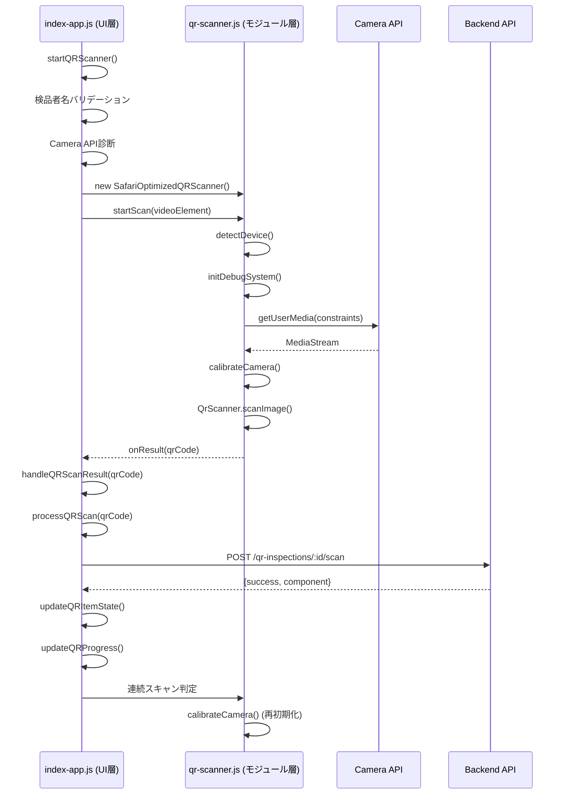

# QRスキャン機能比較: index-app.js vs qr-scanner.js

## 📋 概要

このドキュメントでは、`index-app.js`（アプリケーション統合層）と`qr-scanner.js`（QRスキャナーモジュール）のQRスキャン機能を詳細に比較します。

---

## 🏗️ アーキテクチャ比較

### **index-app.js（アプリケーション層）**
- **役割**: ビジネスロジック統合とUI制御
- **依存関係**: `SafariOptimizedQRScanner`をインポート
- **スコープ**: 検品ワークフロー全体の管理

### **qr-scanner.js（モジュール層）**
- **役割**: QRスキャン機能の純粋実装
- **依存関係**: QrScanner UMD Library
- **スコープ**: カメラ制御とQR検出のみ

---

## 📊 機能比較マトリックス

| 機能カテゴリ | index-app.js | qr-scanner.js | 備考 |
|------------|--------------|--------------|------|
| **デバイス検出** | ❌ なし | ✅ 詳細検出 | iOS/iPad/Safariバージョン検出 |
| **カメラ制約** | ❌ なし | ✅ 5段階フォールバック | environment/user/facingModeなど |
| **キャリブレーション** | ❌ なし | ✅ iOS最適化 | 3秒タイミング、readyState柔軟性 |
| **デバッグシステム** | ❌ なし | ✅ リアルタイム監視 | device/stream/detection/frame状態 |
| **エラー処理** | ⚠️ 基本的 | ✅ iOS特化HTML | デバイス別ガイダンス |
| **UI統合** | ✅ 完全実装 | ❌ なし | Bootstrap Modal、進捗管理 |
| **ビジネスロジック** | ✅ 検品ワークフロー | ❌ なし | API連携、在庫管理 |
| **連続スキャン** | ✅ 自動再開 | ⚠️ 手動制御 | processQRScan後の自動化 |

---

## 🔍 詳細機能リスト

### 1️⃣ **index-app.js のQRSCAN機能**

#### **A. 初期化・モーダル管理**
```javascript
✅ initializeModals()
   - Bootstrap Modalの初期化
   - qrInspectionModal のライフサイクル管理
   - hidden.bs.modal イベントでスキャナー停止

✅ initializeEventListeners()
   - btn-start-qr-scan → startQRScanner
   - btn-complete-qr-inspection → completeQRInspection
```

#### **B. QR検品セッション管理**
```javascript
✅ openQRInspection(item)
   - 同梱物リストの取得
   - qrContext の初期化
   - 検品モーダルの表示

✅ renderQRInspectionContent(context)
   - 出荷情報カードの生成
   - カメラビデオエリアのレンダリング
   - 同梱物チェックリストの構築
   - UI要素の参照保存（qrVideoElement, qrStatusBadge等）
```

#### **C. スキャナー制御**
```javascript
✅ startQRScanner()
   - 検品者名のバリデーション
   - Camera API診断ロギング
   - HTTP/HTTPS環境チェック
   - SafariOptimizedQRScannerのインスタンス化
   - UIの動的切り替え（初期メッセージ → ビデオ表示）
   - カメラ起動エラーハンドリング

✅ stopQRScanner()
   - safariScanner.stopScan() 呼び出し
   - UIのリセット（ビデオ非表示 → 初期メッセージ表示）
   - スキャンラインの非表示

✅ resetQRState()
   - すべてのグローバル変数をnullにリセット
   - モーダル閉鎖時のクリーンアップ
```

#### **D. QR処理ロジック**
```javascript
✅ handleQRScanResult(qrCode)
   - processQRScan()でビジネスロジック実行
   - 連続スキャンの制御（1秒待機後に再開）
   - iPhone Safari向けの再初期化
   - スキャン完了判定

✅ processQRScan(qrCode)
   - API POST: /qr-inspections/:id/scan
   - qrContext.items の status 更新
   - UI更新（updateQRItemState, updateQRProgress）
   - 検品数量の計算と表示

✅ simulateQRScan()
   - テスト用の自動スキャン
   - ランダムなpendingアイテムを選択
```

#### **E. UI更新機能**
```javascript
✅ updateQRStatusMessage(message)
   - qrStatusBadge のテキスト更新
   - statusOverlay への反映

✅ updateQRItemState(componentId, statusText)
   - カードのscannedクラス追加
   - アイコン変更（時計 → チェック）
   - ステータスバッジの更新

✅ updateQRProgress(scanned, total)
   - 進捗ラベルの更新（例: "3/5"）

✅ showQRResult(message, type)
   - アラートメッセージの表示
   - success/danger/info スタイル適用

✅ toggleQRControls({ scanning })
   - スキャンボタンの有効/無効制御
   - シミュレートボタンの状態管理
```

#### **F. 検品完了処理**
```javascript
✅ completeQRInspection()
   - 未確認アイテムの確認プロンプト
   - API PATCH: /qr-inspections/:id/complete
   - 在庫数更新結果の表示
   - モーダル閉鎖と出荷リスト再読み込み
```

#### **G. エラーハンドリング**
```javascript
✅ handleQRScannerError(message)
   - Toastでエラー表示
   - ステータスメッセージ更新

✅ Camera API診断
   - navigator.mediaDevices のチェック
   - プロトコル（HTTP/HTTPS）の検証
   - UserAgent情報のロギング
   - 詳細なエラーメッセージ生成
```

---

### 2️⃣ **qr-scanner.js のQRSCAN機能**

#### **A. デバイス検出**
```javascript
✅ detectDevice()
   - iOS/iPad/iPhone識別
   - iOSメジャーバージョン取得
   - Safari/Chrome/Edgeブラウザ判定
   - 詳細なUserAgent解析

✅ deviceInfo オブジェクト
   {
     isIOS: boolean,
     isIPad: boolean,
     isIPhone: boolean,
     isSafari: boolean,
     iosVersion: { major, minor, patch }
   }
```

#### **B. カメラ制約管理**
```javascript
✅ 5段階フォールバック制約
   1. environment + ideal facingMode
   2. environment のみ
   3. user 指定
   4. facingMode: environment
   5. 制約なし（デフォルト）

✅ applyCameraConstraints()
   - 段階的な制約適用
   - iOS特化の設定
   - エラー時の自動フォールバック
```

#### **C. キャリブレーション**
```javascript
✅ calibrateCamera()
   - iOS: 3秒待機（最適化済み）
   - その他: 1.5秒待機
   - readyState >= 1 の柔軟な継続条件
   - 詳細なデバッグロギング
   - タイムアウト処理（15秒）

✅ waitForVideoReady(video, timeout)
   - Promiseベースの待機
   - readyStateチェック
   - loadedmetadata/canplay イベント監視
```

#### **D. デバッグシステム**
```javascript
✅ initDebugSystem()
   - デバッグUIコンテナの動的生成
   - 4種類のデバッグ要素作成
     • device: デバイス情報
     • stream: ストリーム状態
     • detection: 検出状態
     • frame: フレームカウンター

✅ updateDebug(type, value)
   - リアルタイム状態更新
   - DOM要素への反映

✅ startFrameCounter()
   - 1秒ごとのフレームレート計測
   - パフォーマンス監視
```

#### **E. スキャン制御**
```javascript
✅ startScan(videoElement)
   - デバッグシステム初期化
   - カメラストリーム取得
   - キャリブレーション実行
   - QrScanner インスタンス作成
   - フレームカウンター開始

✅ stopScan()
   - QrScanner停止
   - ストリームトラック終了
   - UI状態のリセット
   - デバッグ情報の更新

✅ QR検出コールバック
   - onResult: QRコード検出成功
   - onError: エラー発生
   - onStatusUpdate: ステータス変更通知
```

#### **F. エラー処理**
```javascript
✅ handleError(messageOrError, error)
   - iOS特化判定
   - デバッグステータス更新
   - エラータイプ分類

✅ getIOSSpecificErrorMessage(error)
   - HTML形式のエラーメッセージ
   - エラー別の詳細ガイダンス
     • NotAllowedError: Safari設定手順
     • NotFoundError: カメラ確認方法
     • NotSupportedError: iOSバージョン警告
     • NotReadableError: アプリ競合解決
     • SecurityError: HTTPS要件説明
     • AbortError: 再試行手順

✅ getGenericErrorMessage(error)
   - 非iOS環境向けのシンプルメッセージ
   - 標準的なエラー説明

✅ showNotSupportedError()
   - BarcodeDetector API非対応時の専用メッセージ
   - iOS Safari向けの代替手段提示
```

---

## 🔄 相互作用フロー



---

## 🎯 機能の役割分担

### **index-app.js が担当**
1. ✅ **ビジネスロジック**: 検品ワークフロー、在庫管理
2. ✅ **UI制御**: Bootstrap Modal、進捗表示、Toast通知
3. ✅ **API連携**: 検品記録の作成・更新・完了
4. ✅ **セッション管理**: qrContext、qrInspectionRecord
5. ✅ **連続スキャン**: 自動再開ロジック

### **qr-scanner.js が担当**
1. ✅ **デバイス最適化**: iOS/Safari特化の設定
2. ✅ **カメラ制御**: 5段階制約フォールバック
3. ✅ **キャリブレーション**: デバイス別タイミング調整
4. ✅ **デバッグ**: リアルタイム状態監視
5. ✅ **エラー処理**: iOS特化HTMLメッセージ

---

## 🚀 統合の強み

### **1. 責任の明確な分離**
- index-app.js: アプリケーションロジック
- qr-scanner.js: QRスキャン技術実装

### **2. 再利用性**
- qr-scanner.jsは他のプロジェクトでも使用可能
- index-app.jsは検品業務に特化

### **3. iOS最適化**
- qr-scanner.jsのデバイス検出
- index-app.jsの連続スキャン制御
- 両者の連携で高い互換性を実現

### **4. エラー対応の多層防御**
- qr-scanner.js: 技術的エラー（カメラ、API）
- index-app.js: ビジネスエラー（バリデーション、API連携）

---

## 📈 改善提案

### **index-app.js の改善候補**
1. ⚠️ Camera API診断をqr-scanner.jsに移譲
2. ⚠️ デバイス検出ロジックの重複排除
3. ⚠️ エラーメッセージのHTML対応（現在はプレーンテキスト）

### **qr-scanner.js の改善候補**
1. ⚠️ 連続スキャンモードの追加（自動再開）
2. ⚠️ スキャン成功時のサウンドフィードバック
3. ⚠️ バイブレーション対応（iOS/Android）

---

## 📝 まとめ

| 項目 | index-app.js | qr-scanner.js |
|-----|-------------|---------------|
| **レイヤー** | アプリケーション層 | 技術実装層 |
| **焦点** | 検品ワークフロー | QRスキャン技術 |
| **依存** | qr-scanner.js | QrScanner UMD |
| **iOS対応** | 連続スキャン制御 | デバイス最適化 |
| **エラー** | ビジネス検証 | 技術的HTML案内 |
| **再利用** | 検品専用 | 汎用モジュール |

**結論**: 両者は完璧に補完し合い、堅牢で使いやすいiOS対応QRスキャン検品システムを実現しています。

---

**生成日時**: 2025-10-15  
**バージョン**: index-app.js (1076行) / qr-scanner.js (強化版)  
**対象環境**: iOS Safari 15+, Chrome/Edge for iOS
