# 生産管理システム - システム仕様書

**バージョン**: 1.2.0
**最終更新**: 2025年10月
**ドキュメント種別**: システム仕様書

---

## 📋 目次

1. [システム概要](#1-システム概要)
2. [システムアーキテクチャ](#2-システムアーキテクチャ)
3. [データベース設計](#3-データベース設計)
4. [API仕様](#4-api仕様)
5. [フロントエンド仕様](#5-フロントエンド仕様)
6. [インフラストラクチャ](#6-インフラストラクチャ)
7. [セキュリティ](#7-セキュリティ)
8. [運用・保守](#8-運用保守)

---

## 1. システム概要

### 1.1 システム名称

**生産管理・出荷検品統合システム**

### 1.2 目的

製造業における生産計画から出荷検品までの全工程を統合管理し、リアルタイムな在庫管理とQRコードベースの検品システムにより、業務効率化と品質向上を実現する。

### 1.3 主要機能

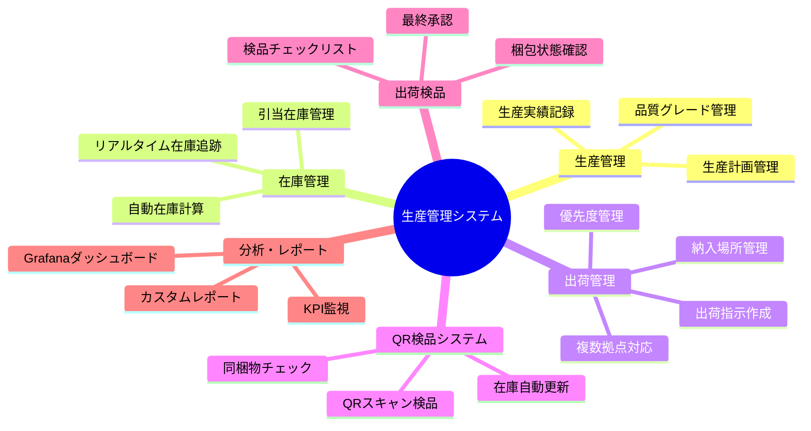

### 1.4 技術スタック

| レイヤー | 技術 | バージョン |
|---------|------|-----------|
| **フロントエンド** | HTML5, CSS3, JavaScript | - |
| **バックエンド** | Node.js + Express | 18.x |
| **データベース** | PostgreSQL | 15.5 |
| **リバースプロキシ** | nginx | Alpine |
| **監視** | Grafana + Prometheus | Latest |
| **コンテナ** | Docker + Docker Compose | - |
| **インフラ** | AWS (Terraform) | - |

### 1.5 対応デバイス

- **デスクトップ**: Windows/Mac/Linux (Chrome, Firefox, Edge)
- **タブレット**: iPad Mini (7.9インチ)
- **スマートフォン**: iPhone 6以降 (4.7インチ〜)
- **PWA対応**: オフライン機能、ホーム画面追加

---

## 2. システムアーキテクチャ

### 2.1 全体構成図

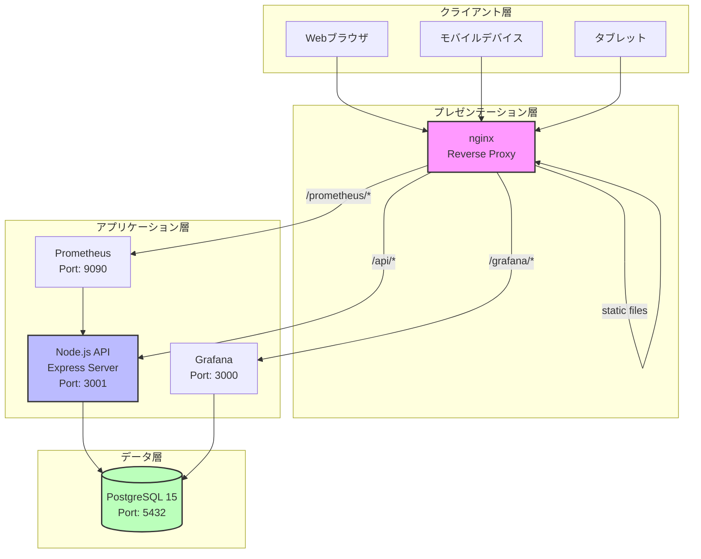

### 2.2 コンポーネント構成

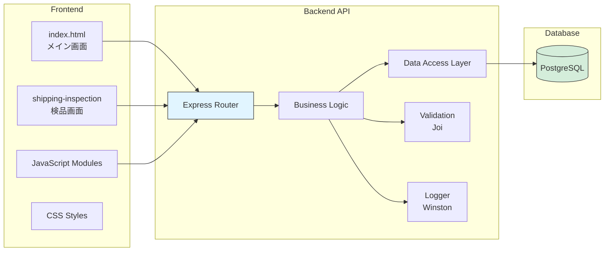

### 2.3 Docker構成

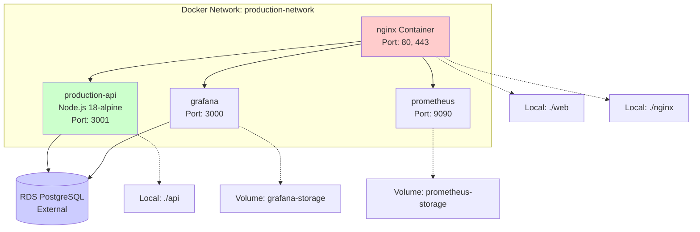

### 2.4 デプロイメント構成 (AWS)

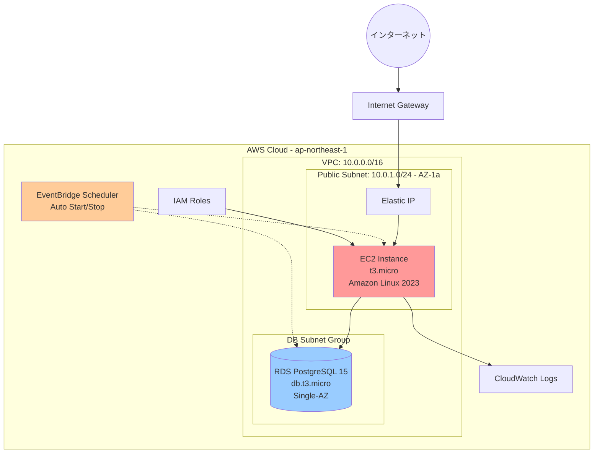

### 2.5 データフロー

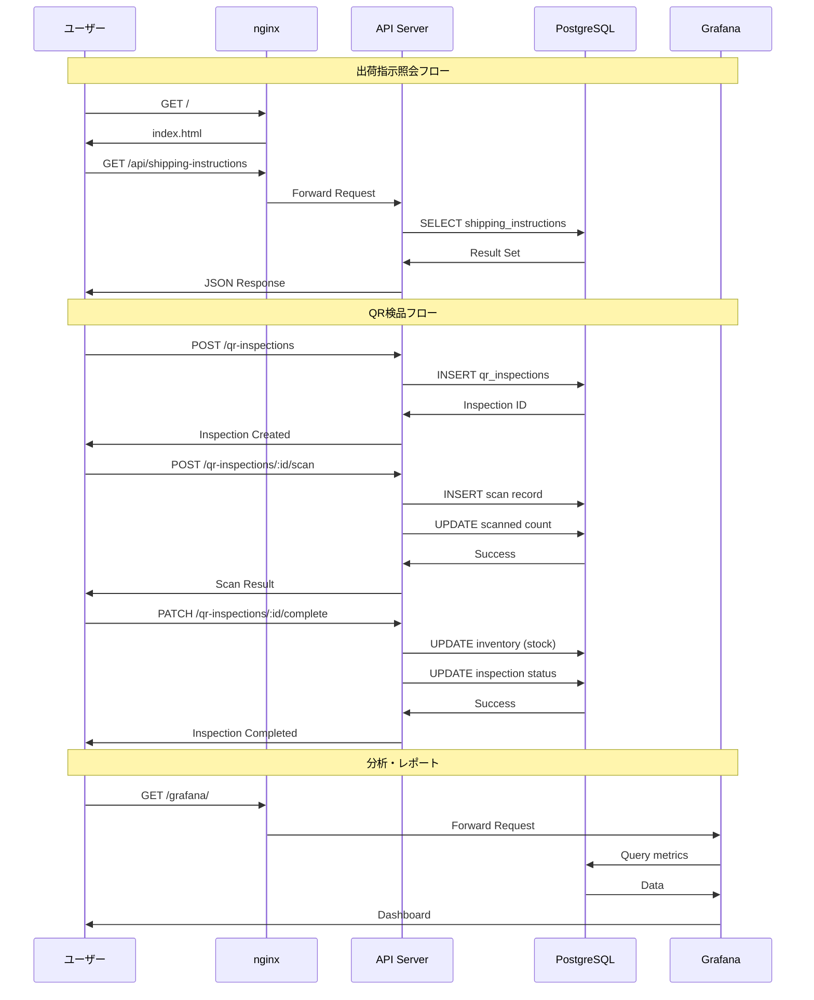

---

## 3. データベース設計

### 3.1 ER図

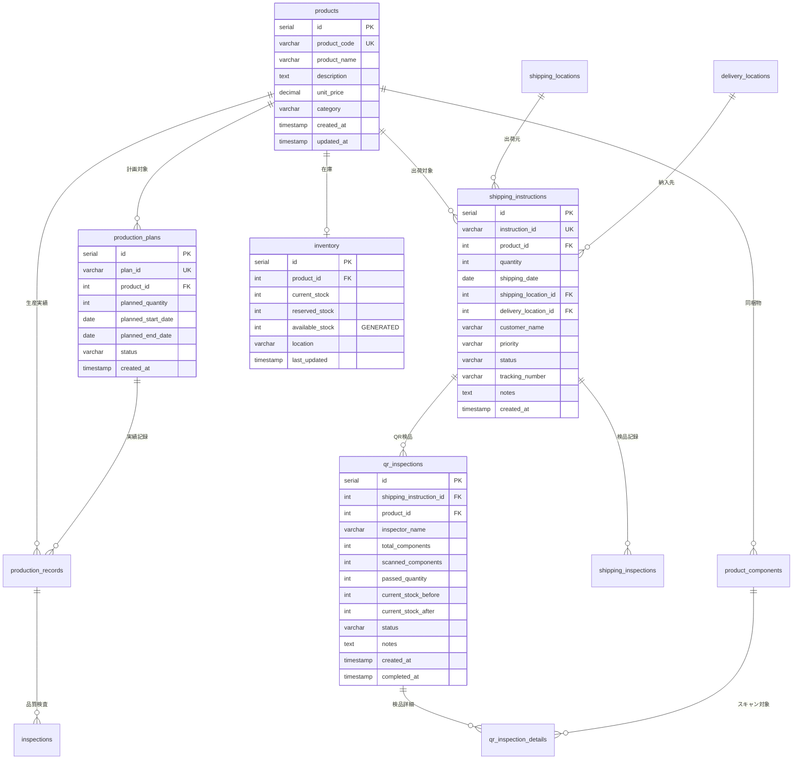

### 3.2 主要テーブル定義

#### 3.2.1 製品マスタ (products)

| カラム名 | 型 | 制約 | 説明 |
|---------|----|----|------|
| id | SERIAL | PRIMARY KEY | 製品ID |
| product_code | VARCHAR(50) | UNIQUE, NOT NULL | 製品コード |
| product_name | VARCHAR(255) | NOT NULL | 製品名 |
| description | TEXT | - | 説明 |
| unit_price | DECIMAL(10,2) | - | 単価 |
| category | VARCHAR(100) | - | カテゴリ |
| created_at | TIMESTAMP | DEFAULT CURRENT_TIMESTAMP | 作成日時 |
| updated_at | TIMESTAMP | DEFAULT CURRENT_TIMESTAMP | 更新日時 |

**インデックス**: `idx_products_code` ON (product_code)

#### 3.2.2 出荷指示 (shipping_instructions)

| カラム名 | 型 | 制約 | 説明 |
|---------|----|----|------|
| id | SERIAL | PRIMARY KEY | 出荷指示ID |
| instruction_id | VARCHAR(50) | UNIQUE, NOT NULL | 出荷指示番号 |
| product_id | INTEGER | FK → products(id) | 製品ID |
| quantity | INTEGER | NOT NULL | 数量 |
| shipping_date | DATE | - | 出荷予定日 |
| shipping_location_id | INTEGER | FK → shipping_locations(id) | 出荷場所ID |
| delivery_location_id | INTEGER | FK → delivery_locations(id) | 納入場所ID |
| customer_name | VARCHAR(255) | - | 顧客名 |
| priority | VARCHAR(20) | DEFAULT 'normal' | 優先度 (high/normal/low) |
| status | VARCHAR(20) | DEFAULT 'pending' | ステータス |
| tracking_number | VARCHAR(100) | - | 追跡番号 |
| notes | TEXT | - | 備考 |
| created_at | TIMESTAMP | DEFAULT CURRENT_TIMESTAMP | 作成日時 |
| updated_at | TIMESTAMP | DEFAULT CURRENT_TIMESTAMP | 更新日時 |

**インデックス**: `idx_shipping_instructions_status` ON (status)

**ステータス遷移**:
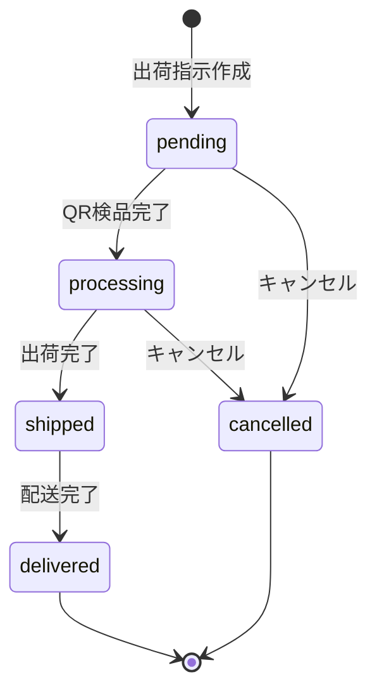

#### 3.2.3 在庫 (inventory)

| カラム名 | 型 | 制約 | 説明 |
|---------|----|----|------|
| id | SERIAL | PRIMARY KEY | 在庫ID |
| product_id | INTEGER | FK → products(id) | 製品ID |
| current_stock | INTEGER | NOT NULL, DEFAULT 0 | 現在庫 |
| reserved_stock | INTEGER | NOT NULL, DEFAULT 0 | 引当在庫 |
| available_stock | INTEGER | GENERATED ALWAYS AS | 利用可能在庫 (自動計算) |
| location | VARCHAR(100) | - | 保管場所 |
| last_updated | TIMESTAMP | DEFAULT CURRENT_TIMESTAMP | 最終更新日時 |

**計算カラム**:
```sql
available_stock = current_stock - reserved_stock
```

#### 3.2.4 QR検品 (qr_inspections)

| カラム名 | 型 | 制約 | 説明 |
|---------|----|----|------|
| id | SERIAL | PRIMARY KEY | QR検品ID |
| shipping_instruction_id | INTEGER | FK → shipping_instructions(id) | 出荷指示ID |
| product_id | INTEGER | FK → products(id) | 製品ID |
| inspector_name | VARCHAR(100) | NOT NULL | 検品者名 |
| total_components | INTEGER | NOT NULL, DEFAULT 0 | 総同梱物数 |
| scanned_components | INTEGER | NOT NULL, DEFAULT 0 | スキャン済数 |
| passed_quantity | INTEGER | DEFAULT 0 | 合格数 |
| current_stock_before | INTEGER | - | 検品前在庫 |
| current_stock_after | INTEGER | - | 検品後在庫 |
| status | VARCHAR(20) | DEFAULT 'in_progress' | ステータス |
| notes | TEXT | - | 備考 |
| created_at | TIMESTAMP | DEFAULT CURRENT_TIMESTAMP | 作成日時 |
| completed_at | TIMESTAMP | - | 完了日時 |
| updated_at | TIMESTAMP | DEFAULT CURRENT_TIMESTAMP | 更新日時 |

**ステータス**: `in_progress`, `completed`, `failed`

### 3.3 ビュー定義

#### shipping_instruction_summary

出荷指示のサマリー情報を提供するビュー

```sql
CREATE VIEW shipping_instruction_summary AS
SELECT
    si.instruction_id,
    p.product_code,
    p.product_name,
    si.quantity as ordered_quantity,
    si.customer_name,
    si.shipping_date,
    si.status as shipping_status,
    sl.location_name as shipping_location_name,
    dl.location_name as delivery_location_name,
    dl.location_code as delivery_location_code,
    shi.inspector_name,
    shi.inspection_date,
    shi.passed_quantity,
    shi.final_approval
FROM shipping_instructions si
LEFT JOIN products p ON si.product_id = p.id
LEFT JOIN shipping_locations sl ON si.shipping_location_id = sl.id
LEFT JOIN delivery_locations dl ON si.delivery_location_id = dl.id
LEFT JOIN shipping_inspections shi ON si.id = shi.shipping_instruction_id
ORDER BY si.created_at DESC;
```

---

## 4. API仕様

### 4.1 API概要

**ベースURL**: `http://localhost/api` (ローカル) / `http://<EC2-IP>/api` (AWS)

**認証**: 現在未実装 (POC環境)

**レスポンス形式**: JSON

**エラーハンドリング**:
```json
{
  "error": "エラーメッセージ"
}
```

### 4.2 エンドポイント一覧

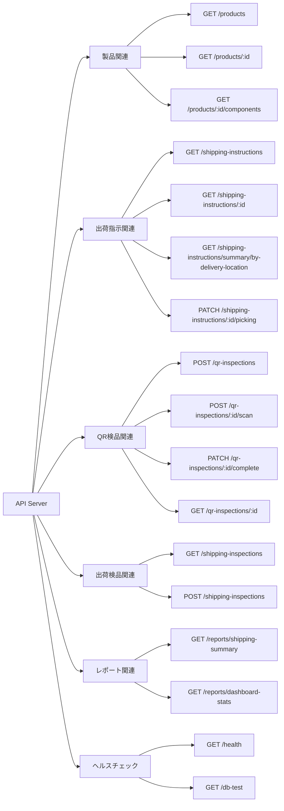

### 4.3 主要エンドポイント詳細

#### 4.3.1 製品一覧取得

**エンドポイント**: `GET /products`

**説明**: 全製品の一覧を在庫情報とともに取得

**レスポンス**:
```json
[
  {
    "id": 1,
    "product_code": "PROD001",
    "product_name": "製品A",
    "description": "標準製品A",
    "unit_price": "1000.00",
    "category": "Category1",
    "current_stock": 75,
    "available_stock": 25
  }
]
```

#### 4.3.2 出荷指示一覧取得

**エンドポイント**: `GET /shipping-instructions`

**クエリパラメータ**:
- `status`: ステータスフィルタ (pending, processing, shipped, delivered)
- `priority`: 優先度フィルタ (high, normal, low)
- `shipping_location`: 出荷場所コード
- `delivery_location`: 納入場所コード
- `shipping_date_from`: 出荷日From (YYYY-MM-DD)
- `shipping_date_to`: 出荷日To (YYYY-MM-DD)
- `instruction_id`: 出荷指示番号 (部分一致)

**例**: `GET /api/shipping-instructions?status=pending&priority=high`

**レスポンス**:
```json
[
  {
    "id": 1,
    "instruction_id": "SHIP001",
    "product_id": 1,
    "product_code": "PROD001",
    "product_name": "製品A",
    "quantity": 50,
    "shipping_date": "2024-08-27",
    "shipping_location_id": 1,
    "shipping_location_name": "東京本社倉庫",
    "shipping_location_code": "TOKYO_MAIN",
    "delivery_location_id": 1,
    "delivery_location_name": "東京営業所",
    "delivery_location_code": "TOKYO_BRANCH",
    "delivery_address": "東京都千代田区丸の内1-1-1",
    "delivery_phone": "03-1234-5678",
    "customer_name": "ABC商事",
    "priority": "high",
    "status": "pending",
    "tracking_number": null,
    "notes": "緊急出荷",
    "created_at": "2024-08-26T10:00:00.000Z",
    "updated_at": "2024-08-26T10:00:00.000Z"
  }
]
```

#### 4.3.3 QR検品開始

**エンドポイント**: `POST /qr-inspections`

**リクエストボディ**:
```json
{
  "shipping_instruction_id": 1,
  "inspector_name": "田中太郎"
}
```

**レスポンス**:
```json
{
  "id": 1,
  "shipping_instruction_id": 1,
  "product_id": 1,
  "inspector_name": "田中太郎",
  "total_components": 5,
  "scanned_components": 0,
  "passed_quantity": 0,
  "current_stock_before": 75,
  "current_stock_after": null,
  "status": "in_progress",
  "notes": null,
  "created_at": "2024-08-26T10:00:00.000Z",
  "completed_at": null,
  "updated_at": "2024-08-26T10:00:00.000Z"
}
```

#### 4.3.4 QRコードスキャン

**エンドポイント**: `POST /qr-inspections/:id/scan`

**リクエストボディ**:
```json
{
  "qr_code": "PROD001-MAIN-001"
}
```

**レスポンス (成功)**:
```json
{
  "success": true,
  "message": "スキャン成功",
  "component": {
    "id": 1,
    "product_id": 1,
    "component_name": "本体",
    "component_type": "main",
    "qr_code": "PROD001-MAIN-001",
    "is_required": true
  },
  "data": {
    "id": 1,
    "qr_inspection_id": 1,
    "product_component_id": 1,
    "qr_code": "PROD001-MAIN-001",
    "status": "scanned",
    "scanned_at": "2024-08-26T10:05:00.000Z"
  }
}
```

**レスポンス (エラー - 重複)**:
```json
{
  "success": false,
  "message": "既にスキャン済みです",
  "component": { ... }
}
```

#### 4.3.5 QR検品完了

**エンドポイント**: `PATCH /qr-inspections/:id/complete`

**リクエストボディ**:
```json
{
  "notes": "検品完了 - 問題なし"
}
```

**レスポンス**:
```json
{
  "id": 1,
  "shipping_instruction_id": 1,
  "product_id": 1,
  "inspector_name": "田中太郎",
  "total_components": 5,
  "scanned_components": 5,
  "passed_quantity": 50,
  "current_stock_before": 75,
  "current_stock_after": 25,
  "status": "completed",
  "notes": "検品完了 - 問題なし",
  "created_at": "2024-08-26T10:00:00.000Z",
  "completed_at": "2024-08-26T10:10:00.000Z",
  "updated_at": "2024-08-26T10:10:00.000Z"
}
```

**処理内容**:
1. 全同梱物がスキャン済みか確認
2. 合格の場合、在庫を減算 (current_stock - passed_quantity)
3. 出荷指示のステータスを `processing` に更新
4. QR検品のステータスを `completed` に更新

### 4.4 レート制限

**設定**:
- ウィンドウ: 15分
- 最大リクエスト数: 100
- プロキシ対応: 有効

**超過時レスポンス**:
```http
HTTP/1.1 429 Too Many Requests
{
  "error": "Too many requests"
}
```

### 4.5 セキュリティヘッダー

Helmetミドルウェアにより以下のヘッダーを自動設定:

- `X-DNS-Prefetch-Control`
- `X-Frame-Options`
- `X-Content-Type-Options`
- `Strict-Transport-Security`
- `X-Download-Options`
- `X-Permitted-Cross-Domain-Policies`

---

## 5. フロントエンド仕様

### 5.1 画面構成

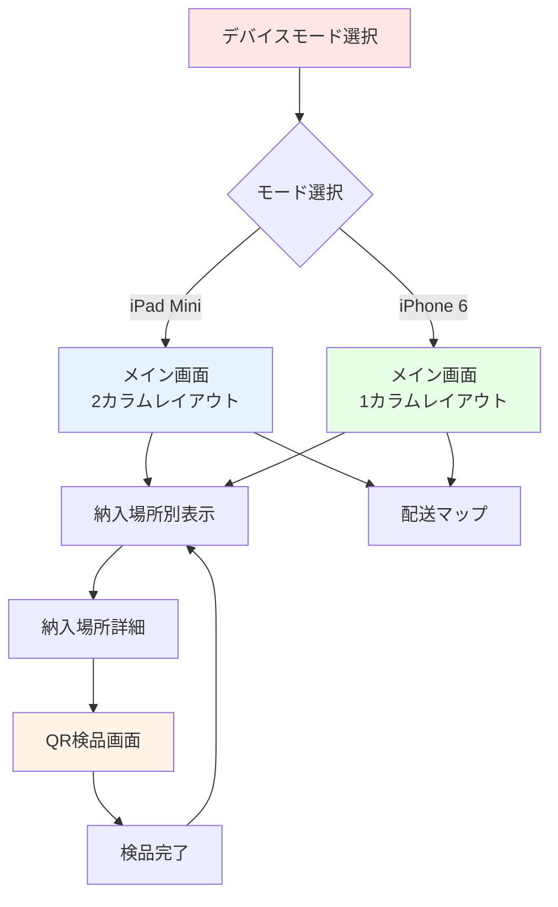

### 5.2 主要画面仕様

#### 5.2.1 デバイスモード選択画面

**目的**: ユーザーのデバイスに最適化されたUIを提供

**モード**:
1. **iPad Mini モード** (768×1024)
   - 2カラムレイアウト
   - 大きな文字サイズ
   - 広い作業エリア

2. **iPhone 6 モード** (375×667)
   - 1カラムレイアウト
   - コンパクト表示
   - 片手操作対応

**機能**:
- LocalStorageに選択を保存
- 画面右上のボタンで切り替え可能

#### 5.2.2 メイン画面 (納入場所別表示)

**表示内容**:
- フィルター機能
  - 出荷場所
  - 納入場所
  - 出荷日範囲
  - 出荷指示番号
- 納入場所別サマリーカード
  - 総品目数
  - 総数量
  - ステータス別集計
  - 配送方法
  - 最早・最遅出荷日

**操作**:
- カードクリックで詳細画面へ遷移
- リアルタイム検索
- データ自動更新

#### 5.2.3 納入場所詳細画面

**表示内容**:
- 納入場所情報
  - 名称、住所、電話番号
  - 担当者、配送方法
- 品目リスト
  - 製品コード・名称
  - 数量
  - 出荷予定日
  - ステータス
  - 優先度

**操作**:
- QR検品開始ボタン
- 個別品目の詳細表示

#### 5.2.4 QR検品画面

**表示内容**:
- 検品情報ヘッダー
  - 出荷指示番号
  - 製品名
  - 数量
  - 検品者名
- 進捗表示
  - プログレスバー
  - スキャン済み/総数
- 同梱物チェックリスト
  - 本体
  - 付属品
  - 説明書
  - 保証書
- QRカメラビュー

**操作フロー**:
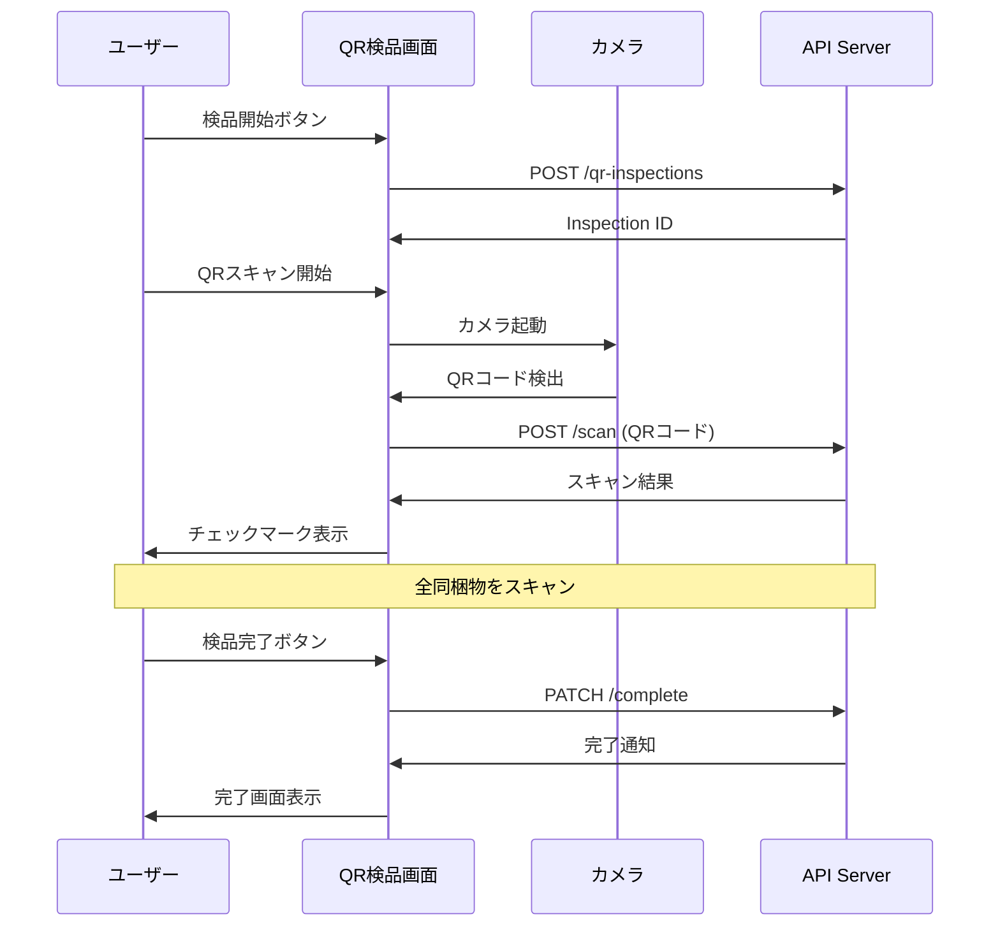

**機能**:
- Safari最適化QRスキャナー
- 重複スキャン検出
- エラーハンドリング
- 音声フィードバック (オプション)

### 5.3 モジュール構成

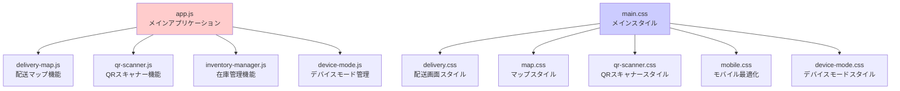

### 5.4 PWA対応

**manifest.json**:
```json
{
  "name": "出荷指示管理システム",
  "short_name": "出荷管理",
  "start_url": "/",
  "display": "standalone",
  "theme_color": "#2563eb",
  "background_color": "#ffffff",
  "icons": [
    {
      "src": "icon-192.png",
      "sizes": "192x192",
      "type": "image/png"
    }
  ]
}
```

**機能**:
- ホーム画面追加
- オフライン対応 (Service Worker)
- プッシュ通知 (将来実装予定)

---

## 6. インフラストラクチャ

### 6.1 ローカル環境 (Docker Compose)

**構成**:
```yaml
services:
  - nginx (Port: 80, 443)
  - production-api (Port: 3001)
  - postgres (Port: 5432)
  - grafana (Port: 3000)
  - prometheus (Port: 9090)
```

**起動方法**:
```bash
./manage.sh start
```

### 6.2 AWS環境 (Terraform)

#### 6.2.1 リソース構成

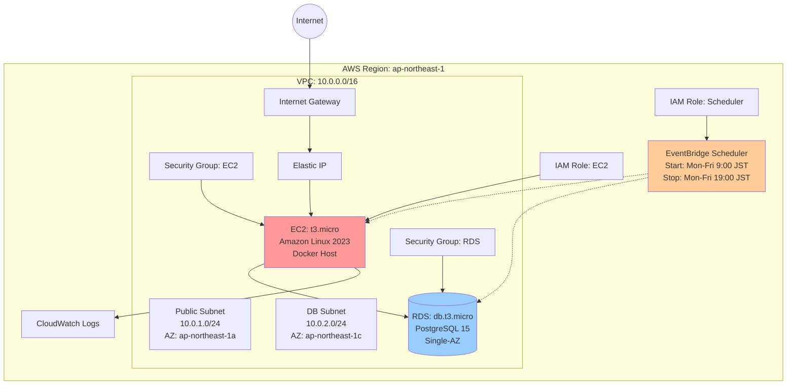

#### 6.2.2 コスト構成 (月額)

**POC環境 (160時間/月稼働)**:

| リソース | スペック | 稼働時間 | 月額 |
|---------|---------|---------|------|
| EC2 | t3.micro (1vCPU, 1GB) | 160h | $3-4 |
| RDS | db.t3.micro (2vCPU, 1GB) | 160h | $12-15 |
| EBS | gp3 30GB | 720h | $3 |
| Elastic IP | - | 160h | $0 |
| Data Transfer | ~1GB | - | $1-2 |
| **合計** | | | **$19-24** |

**スケジュール設定**:
```hcl
start_schedule = "cron(0 0 ? * MON-FRI *)"   # 9:00 AM JST
stop_schedule  = "cron(0 10 ? * MON-FRI *)"  # 7:00 PM JST
timezone       = "Asia/Tokyo"
```

#### 6.2.3 セキュリティ構成

**EC2 Security Group**:
| タイプ | ポート | ソース | 説明 |
|-------|--------|--------|------|
| HTTP | 80 | 0.0.0.0/0 | Webアクセス |
| HTTPS | 443 | 0.0.0.0/0 | セキュアWebアクセス |
| SSH | 22 | 管理者IP | SSH管理アクセス |

**RDS Security Group**:
| タイプ | ポート | ソース | 説明 |
|-------|--------|--------|------|
| PostgreSQL | 5432 | EC2 SG | EC2からのDB接続 |

**IAM Policies**:
- EC2: SSM Session Manager, CloudWatch Logs
- Scheduler: EC2 Start/Stop, RDS Start/Stop

### 6.3 監視・ログ

#### 6.3.1 CloudWatch Logs

**ログストリーム**:
- `/aws/rds/instance/poc-production-db/postgresql`
- `/aws/ec2/production-management`

#### 6.3.2 Grafana ダッシュボード

**メトリクス**:
- 出荷指示ステータス別集計
- 検品完了率
- 在庫推移
- API レスポンスタイム

#### 6.3.3 アラート

**設定項目**:
- EC2 CPU使用率 > 80%
- RDS 接続数 > 50
- ディスク使用率 > 80%
- API エラー率 > 5%

---

## 7. セキュリティ

### 7.1 セキュリティ対策一覧

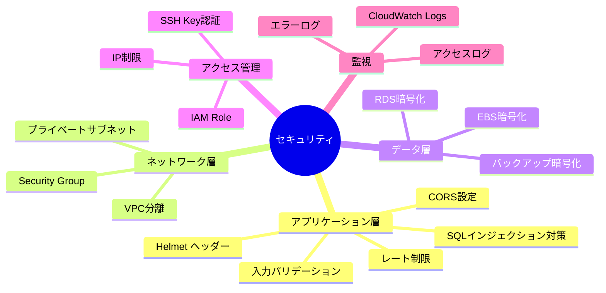

### 7.2 実装済みセキュリティ機能

#### 7.2.1 アプリケーションレベル

**Helmet.js**:
```javascript
app.use(helmet());
```
設定されるヘッダー:
- `X-DNS-Prefetch-Control: off`
- `X-Frame-Options: SAMEORIGIN`
- `X-Content-Type-Options: nosniff`
- `Strict-Transport-Security`
- `X-Download-Options: noopen`

**CORS**:
```javascript
app.use(cors());
```

**レート制限**:
```javascript
const limiter = rateLimit({
  windowMs: 15 * 60 * 1000,  // 15分
  max: 100,                   // 100リクエスト
  trustProxy: true
});
```

**入力バリデーション (Joi)**:
```javascript
const shippingInspectionSchema = Joi.object({
  shipping_instruction_id: Joi.number().required(),
  inspector_name: Joi.string().max(100).required(),
  inspected_quantity: Joi.number().min(0).required(),
  // ...
});
```

**SQLインジェクション対策**:
```javascript
// パラメータ化クエリ
pool.query('SELECT * FROM products WHERE id = $1', [id]);
```

#### 7.2.2 インフラストラクチャレベル

**暗号化**:
- EBS: 有効
- RDS: 有効
- 通信: HTTPS対応 (SSL証明書配置済み)

**アクセス制御**:
- EC2: SSH Key認証
- RDS: VPC内部からのみアクセス
- API: レート制限

### 7.3 推奨セキュリティ強化

**本番環境での対応事項**:

1. **認証・認可の実装**
   - JWT認証
   - ロールベースアクセス制御 (RBAC)
   - セッション管理

2. **ネットワークセキュリティ**
   - WAF導入 (AWS WAF)
   - DDoS対策 (AWS Shield)
   - VPN接続

3. **監査・コンプライアンス**
   - アクセスログ分析
   - セキュリティ監査
   - 脆弱性スキャン

4. **データ保護**
   - フィールドレベル暗号化
   - バックアップ暗号化
   - データマスキング

---

## 8. 運用・保守

### 8.1 バックアップ戦略

#### 8.1.1 RDS自動バックアップ

**設定**:
- バックアップウィンドウ: 03:00-04:00 UTC (12:00-13:00 JST)
- 保持期間: 7日間
- スナップショット: 自動

**復元手順**:
```bash
# スナップショット一覧
aws rds describe-db-snapshots \
  --db-instance-identifier poc-production-db

# 復元
aws rds restore-db-instance-from-db-snapshot \
  --db-instance-identifier new-instance \
  --db-snapshot-identifier snapshot-id
```

#### 8.1.2 手動バックアップ

**データベース**:
```bash
# バックアップ
./manage.sh backup

# または
docker-compose exec postgres pg_dump \
  -U production_user production_db > backup.sql

# 復元
docker-compose exec -T postgres psql \
  -U production_user -d production_db < backup.sql
```

**アプリケーション**:
```bash
# コード: Git管理
git push origin main

# 設定ファイル: バックアップ
tar -czf config-backup.tar.gz \
  .env docker-compose.yml nginx/ grafana/
```

### 8.2 監視項目

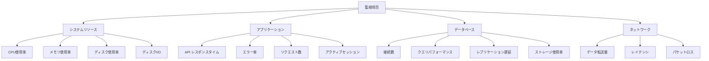

### 8.3 アラート閾値

| 項目 | Warning | Critical |
|-----|---------|----------|
| CPU使用率 | 70% | 90% |
| メモリ使用率 | 75% | 90% |
| ディスク使用率 | 80% | 90% |
| DB接続数 | 40 | 50 |
| APIエラー率 | 3% | 5% |
| レスポンスタイム | 1000ms | 3000ms |

### 8.4 スケーリング戦略

#### 8.4.1 垂直スケーリング (スペックアップ)

**EC2**:
```hcl
# terraform.tfvars
instance_type = "t3.small"   # 1GB → 2GB RAM
# または
instance_type = "t3.medium"  # 1GB → 4GB RAM
```

**RDS**:
```hcl
db_instance_class = "db.t3.small"   # 1GB → 2GB RAM
# または
db_instance_class = "db.t3.medium"  # 1GB → 4GB RAM
```

#### 8.4.2 水平スケーリング (ECS移行)

**将来の拡張計画**:
1. ECS Fargate移行
2. ALBによる負荷分散
3. RDS Read Replica追加
4. ElastiCache導入

### 8.5 メンテナンス手順

#### 8.5.1 定期メンテナンス

**週次**:
- ログローテーション確認
- ディスク使用量確認
- バックアップ確認

**月次**:
- セキュリティパッチ適用
- パフォーマンス分析
- コストレビュー

**四半期**:
- 災害復旧テスト
- セキュリティ監査
- キャパシティプランニング

#### 8.5.2 トラブルシューティング

**EC2が起動しない**:
```bash
# コンソール出力確認
aws ec2 get-console-output \
  --instance-id i-xxxxx

# ログ確認
ssh ec2-user@<IP>
sudo journalctl -u production-management
```

**データベース接続エラー**:
```bash
# 接続テスト
docker run --rm -it postgres:15-alpine \
  psql -h <RDS_ENDPOINT> -U production_user -d production_db

# ログ確認
aws logs tail /aws/rds/instance/poc-production-db/postgresql
```

**アプリケーションエラー**:
```bash
# コンテナログ確認
docker-compose logs production-api

# APIログ確認
tail -f api/error.log
tail -f api/combined.log
```

### 8.6 災害復旧計画 (DR)

#### 8.6.1 RPO/RTO目標

| 項目 | 目標 |
|-----|------|
| **RPO** (Recovery Point Objective) | 24時間 |
| **RTO** (Recovery Time Objective) | 4時間 |

#### 8.6.2 復旧手順

**データベース障害**:
1. 最新スナップショットから復元
2. アプリケーション接続先変更
3. 動作確認

**EC2障害**:
1. 新しいEC2インスタンス起動
2. アプリケーションデプロイ
3. Elastic IP付け替え
4. 動作確認

**完全障害**:
1. 別リージョンにTerraform適用
2. データベース復元
3. アプリケーションデプロイ
4. DNSレコード更新

---

## 付録

### A. 用語集

| 用語 | 説明 |
|-----|------|
| **QR検品** | QRコードをスキャンして製品の同梱物を確認する検品方式 |
| **引当在庫** | 出荷予定として確保されている在庫 |
| **利用可能在庫** | 現在庫から引当在庫を引いた実際に使用可能な在庫 |
| **出荷場所** | 製品を出荷する倉庫や拠点 |
| **納入場所** | 製品を配送する顧客の営業所や倉庫 |
| **Single-AZ** | 単一のアベイラビリティゾーンにリソースを配置する構成 |

### B. 変更履歴

| バージョン | 日付 | 変更内容 |
|-----------|------|----------|
| 1.0.0 | 2024-08 | 初版リリース - 基本機能 |
| 1.1.0 | 2024-09 | QR検品システム追加 |
| 1.2.0 | 2025-10 | AWS対応、Terraform構成追加 |

### C. 参考資料

- [Docker Documentation](https://docs.docker.com/)
- [PostgreSQL 15 Documentation](https://www.postgresql.org/docs/15/)
- [Express.js Guide](https://expressjs.com/)
- [Terraform AWS Provider](https://registry.terraform.io/providers/hashicorp/aws/latest/docs)
- [AWS Well-Architected Framework](https://aws.amazon.com/architecture/well-architected/)

---

**文書管理情報**

- **作成者**: Claude Code
- **承認者**: -
- **配布先**: プロジェクトメンバー
- **機密区分**: 社外秘
- **次回レビュー**: 2025-11

---

**本書に関するお問い合わせ**

技術的な質問や不明点については、プロジェクトリポジトリのIssueで管理してください。
