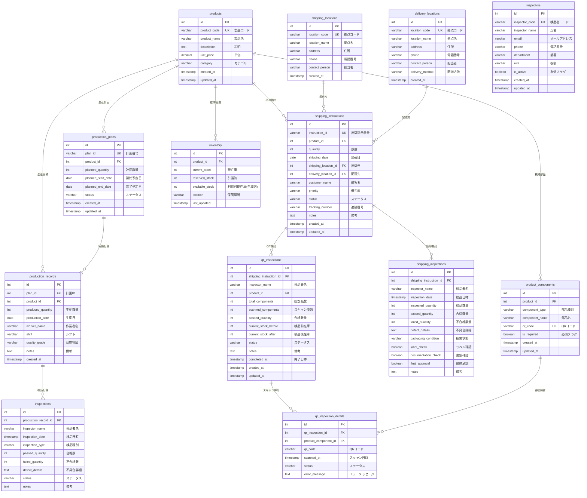

# データベース設計書

生産管理システム (production_db) のデータベース設計書

**バージョン:** 2.2.0
**最終更新:** 2025-11-14
**DBMS:** PostgreSQL 15

---

## 目次

1. [ERD（Entity Relationship Diagram）](#erd)
2. [テーブル一覧](#テーブル一覧)
3. [テーブル詳細設計](#テーブル詳細設計)
4. [インデックス一覧](#インデックス一覧)
5. [ビュー一覧](#ビュー一覧)

---

## ERD

### 全体構成図



---

## テーブル一覧

| No | テーブル名 | 論理名 | 説明 | 行数(想定) |
|----|-----------|--------|------|-----------|
| 1 | products | 製品マスタ | 製品の基本情報を管理 | 100-1000 |
| 2 | production_plans | 生産計画 | 製品の生産計画を管理 | 1000-10000 |
| 3 | production_records | 生産実績 | 生産実績を記録 | 10000-100000 |
| 4 | inspections | 検品記録 | 生産工程での検品記録 | 10000-100000 |
| 5 | shipping_locations | 出荷元拠点マスタ | 出荷元となる倉庫・工場情報 | 10-50 |
| 6 | delivery_locations | 配送先拠点マスタ | 配送先の顧客拠点情報 | 50-500 |
| 7 | shipping_instructions | 出荷指示 | 顧客への出荷指示を管理 | 10000-100000 |
| 8 | shipping_inspections | 出荷検品記録 | 出荷前の最終検品記録 | 10000-100000 |
| 9 | inventory | 在庫 | 製品の在庫情報を管理 | 100-1000 |
| 10 | product_components | 製品構成部品 | 製品を構成する部品とQRコード | 500-5000 |
| 11 | qr_inspections | QR検品記録 | QRコードベースの検品セッション | 10000-100000 |
| 12 | qr_inspection_details | QR検品詳細 | 個別部品のスキャン記録 | 50000-500000 |
| 13 | inspectors | 検品者マスタ | 検品者の基本情報を管理 | 10-100 |

---

## テーブル詳細設計

### 1. products (製品マスタ)

**テーブル説明:** 製品の基本情報を管理するマスタテーブル

| カラム名 | 型 | NULL | デフォルト | 説明 | 制約 |
|---------|-----|------|-----------|------|------|
| id | SERIAL | NOT NULL | AUTO | 製品ID（主キー） | PK |
| product_code | VARCHAR(50) | NOT NULL | - | 製品コード | UK, NOT NULL |
| product_name | VARCHAR(255) | NOT NULL | - | 製品名 | NOT NULL |
| description | TEXT | NULL | - | 製品説明 | - |
| unit_price | DECIMAL(10,2) | NULL | - | 単価 | - |
| category | VARCHAR(100) | NULL | - | カテゴリ | - |
| created_at | TIMESTAMP | NULL | CURRENT_TIMESTAMP | 作成日時 | - |
| updated_at | TIMESTAMP | NULL | CURRENT_TIMESTAMP | 更新日時 | - |

**インデックス:**
- PRIMARY KEY: id
- UNIQUE: product_code
- INDEX: idx_products_code (product_code)

---

### 2. production_plans (生産計画)

**テーブル説明:** 製品の生産計画を管理

| カラム名 | 型 | NULL | デフォルト | 説明 | 制約 |
|---------|-----|------|-----------|------|------|
| id | SERIAL | NOT NULL | AUTO | 計画ID（主キー） | PK |
| plan_id | VARCHAR(50) | NOT NULL | - | 計画番号 | UK, NOT NULL |
| product_id | INTEGER | NULL | - | 製品ID | FK -> products(id) |
| planned_quantity | INTEGER | NOT NULL | - | 計画数量 | NOT NULL |
| planned_start_date | DATE | NULL | - | 開始予定日 | - |
| planned_end_date | DATE | NULL | - | 完了予定日 | - |
| status | VARCHAR(20) | NULL | 'planned' | ステータス | - |
| created_at | TIMESTAMP | NULL | CURRENT_TIMESTAMP | 作成日時 | - |
| updated_at | TIMESTAMP | NULL | CURRENT_TIMESTAMP | 更新日時 | - |

**ステータス値:**
- `planned`: 計画中
- `in_progress`: 進行中
- `completed`: 完了
- `cancelled`: キャンセル

**インデックス:**
- PRIMARY KEY: id
- UNIQUE: plan_id
- FOREIGN KEY: product_id -> products(id)
- INDEX: idx_production_plans_status (status)

---

### 3. production_records (生産実績)

**テーブル説明:** 生産実績を記録

| カラム名 | 型 | NULL | デフォルト | 説明 | 制約 |
|---------|-----|------|-----------|------|------|
| id | SERIAL | NOT NULL | AUTO | 実績ID（主キー） | PK |
| plan_id | INTEGER | NULL | - | 計画ID | FK -> production_plans(id) |
| product_id | INTEGER | NULL | - | 製品ID | FK -> products(id) |
| produced_quantity | INTEGER | NOT NULL | - | 生産数量 | NOT NULL |
| production_date | DATE | NULL | - | 生産日 | - |
| worker_name | VARCHAR(100) | NULL | - | 作業者名 | - |
| shift | VARCHAR(20) | NULL | - | シフト | - |
| quality_grade | VARCHAR(10) | NULL | 'A' | 品質等級 | - |
| notes | TEXT | NULL | - | 備考 | - |
| created_at | TIMESTAMP | NULL | CURRENT_TIMESTAMP | 作成日時 | - |

**品質等級値:**
- `A`: 優良
- `B`: 良
- `C`: 可
- `NG`: 不良

**インデックス:**
- PRIMARY KEY: id
- FOREIGN KEY: plan_id -> production_plans(id)
- FOREIGN KEY: product_id -> products(id)
- INDEX: idx_production_records_date (production_date)

---

### 4. inspections (検品記録)

**テーブル説明:** 生産工程での検品記録

| カラム名 | 型 | NULL | デフォルト | 説明 | 制約 |
|---------|-----|------|-----------|------|------|
| id | SERIAL | NOT NULL | AUTO | 検品ID（主キー） | PK |
| production_record_id | INTEGER | NULL | - | 生産実績ID | FK -> production_records(id) |
| inspector_name | VARCHAR(100) | NOT NULL | - | 検品者名 | NOT NULL |
| inspection_date | TIMESTAMP | NULL | CURRENT_TIMESTAMP | 検品日時 | - |
| inspection_type | VARCHAR(50) | NULL | - | 検品種別 | - |
| passed_quantity | INTEGER | NOT NULL | - | 合格数量 | NOT NULL |
| failed_quantity | INTEGER | NULL | 0 | 不合格数量 | - |
| defect_details | TEXT | NULL | - | 不具合詳細 | - |
| status | VARCHAR(20) | NULL | 'pending' | ステータス | - |
| notes | TEXT | NULL | - | 備考 | - |

**検品種別値:**
- `incoming`: 受入検品
- `in_process`: 工程内検品
- `final`: 最終検品

**ステータス値:**
- `pending`: 待機中
- `passed`: 合格
- `failed`: 不合格
- `rework`: 再加工

**インデックス:**
- PRIMARY KEY: id
- FOREIGN KEY: production_record_id -> production_records(id)
- INDEX: idx_inspections_status (status)

---

### 5. shipping_locations (出荷元拠点マスタ)

**テーブル説明:** 出荷元となる倉庫・工場の情報を管理

| カラム名 | 型 | NULL | デフォルト | 説明 | 制約 |
|---------|-----|------|-----------|------|------|
| id | SERIAL | NOT NULL | AUTO | 拠点ID（主キー） | PK |
| location_code | VARCHAR(20) | NOT NULL | - | 拠点コード | UK, NOT NULL |
| location_name | VARCHAR(255) | NOT NULL | - | 拠点名 | NOT NULL |
| address | VARCHAR(500) | NULL | - | 住所 | - |
| phone | VARCHAR(20) | NULL | - | 電話番号 | - |
| contact_person | VARCHAR(100) | NULL | - | 担当者名 | - |
| created_at | TIMESTAMP | NULL | CURRENT_TIMESTAMP | 作成日時 | - |

**インデックス:**
- PRIMARY KEY: id
- UNIQUE: location_code

---

### 6. delivery_locations (配送先拠点マスタ)

**テーブル説明:** 配送先の顧客拠点情報を管理

| カラム名 | 型 | NULL | デフォルト | 説明 | 制約 |
|---------|-----|------|-----------|------|------|
| id | SERIAL | NOT NULL | AUTO | 拠点ID（主キー） | PK |
| location_code | VARCHAR(20) | NOT NULL | - | 拠点コード | UK, NOT NULL |
| location_name | VARCHAR(255) | NOT NULL | - | 拠点名 | NOT NULL |
| address | VARCHAR(500) | NULL | - | 住所 | - |
| phone | VARCHAR(20) | NULL | - | 電話番号 | - |
| contact_person | VARCHAR(100) | NULL | - | 担当者名 | - |
| delivery_method | VARCHAR(50) | NULL | '宅配便' | 配送方法 | - |
| created_at | TIMESTAMP | NULL | CURRENT_TIMESTAMP | 作成日時 | - |

**配送方法値:**
- `宅配便`: 通常の宅配便
- `チャーター便`: チャーター便
- `直送`: 直送

**インデックス:**
- PRIMARY KEY: id
- UNIQUE: location_code

---

### 7. shipping_instructions (出荷指示)

**テーブル説明:** 顧客への出荷指示を管理

| カラム名 | 型 | NULL | デフォルト | 説明 | 制約 |
|---------|-----|------|-----------|------|------|
| id | SERIAL | NOT NULL | AUTO | 出荷指示ID（主キー） | PK |
| instruction_id | VARCHAR(50) | NOT NULL | - | 出荷指示番号 | UK, NOT NULL |
| product_id | INTEGER | NULL | - | 製品ID | FK -> products(id) |
| quantity | INTEGER | NOT NULL | - | 出荷数量 | NOT NULL |
| shipping_date | DATE | NULL | - | 出荷日 | - |
| shipping_location_id | INTEGER | NULL | - | 出荷元拠点ID | FK -> shipping_locations(id) |
| delivery_location_id | INTEGER | NULL | - | 配送先拠点ID | FK -> delivery_locations(id) |
| customer_name | VARCHAR(255) | NULL | - | 顧客名 | - |
| priority | VARCHAR(20) | NULL | 'normal' | 優先度 | - |
| status | VARCHAR(20) | NULL | 'pending' | ステータス | - |
| tracking_number | VARCHAR(100) | NULL | - | 追跡番号 | - |
| notes | TEXT | NULL | - | 備考 | - |
| created_at | TIMESTAMP | NULL | CURRENT_TIMESTAMP | 作成日時 | - |
| updated_at | TIMESTAMP | NULL | CURRENT_TIMESTAMP | 更新日時 | - |

**優先度値:**
- `high`: 高優先度
- `normal`: 通常優先度
- `low`: 低優先度

**ステータス値:**
- `pending`: 待機中
- `processing`: 処理中
- `shipped`: 出荷済み
- `delivered`: 配送完了

**インデックス:**
- PRIMARY KEY: id
- UNIQUE: instruction_id
- FOREIGN KEY: product_id -> products(id)
- FOREIGN KEY: shipping_location_id -> shipping_locations(id)
- FOREIGN KEY: delivery_location_id -> delivery_locations(id)
- INDEX: idx_shipping_instructions_status (status)

---

### 8. shipping_inspections (出荷検品記録)

**テーブル説明:** 出荷前の最終検品記録

| カラム名 | 型 | NULL | デフォルト | 説明 | 制約 |
|---------|-----|------|-----------|------|------|
| id | SERIAL | NOT NULL | AUTO | 検品ID（主キー） | PK |
| shipping_instruction_id | INTEGER | NULL | - | 出荷指示ID | FK -> shipping_instructions(id) |
| inspector_name | VARCHAR(100) | NOT NULL | - | 検品者名 | NOT NULL |
| inspection_date | TIMESTAMP | NULL | CURRENT_TIMESTAMP | 検品日時 | - |
| inspected_quantity | INTEGER | NOT NULL | - | 検品数量 | NOT NULL |
| passed_quantity | INTEGER | NOT NULL | - | 合格数量 | NOT NULL |
| failed_quantity | INTEGER | NULL | 0 | 不合格数量 | - |
| defect_details | TEXT | NULL | - | 不具合詳細 | - |
| packaging_condition | VARCHAR(50) | NULL | - | 梱包状態 | - |
| label_check | BOOLEAN | NULL | false | ラベル確認 | - |
| documentation_check | BOOLEAN | NULL | false | 書類確認 | - |
| final_approval | BOOLEAN | NULL | false | 最終承認 | - |
| notes | TEXT | NULL | - | 備考 | - |

**インデックス:**
- PRIMARY KEY: id
- FOREIGN KEY: shipping_instruction_id -> shipping_instructions(id)
- INDEX: idx_shipping_inspections_date (inspection_date)

---

### 9. inventory (在庫)

**テーブル説明:** 製品の在庫情報を管理

| カラム名 | 型 | NULL | デフォルト | 説明 | 制約 |
|---------|-----|------|-----------|------|------|
| id | SERIAL | NOT NULL | AUTO | 在庫ID（主キー） | PK |
| product_id | INTEGER | NULL | - | 製品ID | FK -> products(id) |
| current_stock | INTEGER | NOT NULL | 0 | 現在庫数 | NOT NULL |
| reserved_stock | INTEGER | NOT NULL | 0 | 引当済数 | NOT NULL |
| available_stock | INTEGER | - | - | 利用可能在庫数（生成列） | GENERATED COLUMN |
| location | VARCHAR(100) | NULL | - | 保管場所 | - |
| last_updated | TIMESTAMP | NULL | CURRENT_TIMESTAMP | 最終更新日時 | - |

**生成列:**
- `available_stock` = `current_stock` - `reserved_stock` (STORED)
  - PostgreSQLの生成列機能により自動計算される
  - INSERT/UPDATE時に値を指定することはできない

**インデックス:**
- PRIMARY KEY: id
- FOREIGN KEY: product_id -> products(id)

---

### 10. product_components (製品構成部品)

**テーブル説明:** 製品を構成する部品とQRコードのマッピングを管理

| カラム名 | 型 | NULL | デフォルト | 説明 | 制約 |
|---------|-----|------|-----------|------|------|
| id | SERIAL | NOT NULL | AUTO | 部品ID（主キー） | PK |
| product_id | INTEGER | NULL | - | 製品ID | FK -> products(id) CASCADE |
| component_type | VARCHAR(50) | NOT NULL | - | 部品種別 | NOT NULL |
| component_name | VARCHAR(255) | NOT NULL | - | 部品名 | NOT NULL |
| qr_code | VARCHAR(255) | NOT NULL | - | QRコード値 | UK, NOT NULL |
| is_required | BOOLEAN | NULL | true | 必須フラグ | - |
| created_at | TIMESTAMP | NULL | CURRENT_TIMESTAMP | 作成日時 | - |
| updated_at | TIMESTAMP | NULL | CURRENT_TIMESTAMP | 更新日時 | - |

**部品種別値:**
- `main`: 本体
- `accessory`: 付属品
- `manual`: マニュアル
- `warranty`: 保証書

**インデックス:**
- PRIMARY KEY: id
- UNIQUE: qr_code
- FOREIGN KEY: product_id -> products(id) ON DELETE CASCADE
- INDEX: idx_product_components_product_id (product_id)
- INDEX: idx_product_components_qr_code (qr_code)

---

### 11. qr_inspections (QR検品記録)

**テーブル説明:** QRコードベースの検品セッションを管理

| カラム名 | 型 | NULL | デフォルト | 説明 | 制約 |
|---------|-----|------|-----------|------|------|
| id | SERIAL | NOT NULL | AUTO | QR検品ID（主キー） | PK |
| shipping_instruction_id | INTEGER | NULL | - | 出荷指示ID | FK -> shipping_instructions(id) CASCADE |
| inspector_name | VARCHAR(100) | NOT NULL | - | 検品者名 | NOT NULL |
| product_id | INTEGER | NULL | - | 製品ID | FK -> products(id) |
| total_components | INTEGER | NOT NULL | - | 総部品数 | NOT NULL |
| scanned_components | INTEGER | NULL | 0 | スキャン済部品数 | - |
| passed_quantity | INTEGER | NULL | 0 | 合格数量 | - |
| current_stock_before | INTEGER | NULL | - | 検品前在庫数 | - |
| current_stock_after | INTEGER | NULL | - | 検品後在庫数 | - |
| status | VARCHAR(50) | NULL | 'in_progress' | ステータス | - |
| notes | TEXT | NULL | - | 備考 | - |
| completed_at | TIMESTAMP | NULL | - | 完了日時 | - |
| created_at | TIMESTAMP | NULL | CURRENT_TIMESTAMP | 作成日時 | - |
| updated_at | TIMESTAMP | NULL | CURRENT_TIMESTAMP | 更新日時 | - |

**ステータス値:**
- `in_progress`: 進行中
- `completed`: 完了
- `failed`: 失敗

**インデックス:**
- PRIMARY KEY: id
- FOREIGN KEY: shipping_instruction_id -> shipping_instructions(id) ON DELETE CASCADE
- FOREIGN KEY: product_id -> products(id)
- INDEX: idx_qr_inspections_shipping_instruction (shipping_instruction_id)

---

### 12. qr_inspection_details (QR検品詳細)

**テーブル説明:** 個別部品のスキャン記録

| カラム名 | 型 | NULL | デフォルト | 説明 | 制約 |
|---------|-----|------|-----------|------|------|
| id | SERIAL | NOT NULL | AUTO | 詳細ID（主キー） | PK |
| qr_inspection_id | INTEGER | NULL | - | QR検品ID | FK -> qr_inspections(id) CASCADE |
| product_component_id | INTEGER | NULL | - | 部品ID | FK -> product_components(id) |
| qr_code | VARCHAR(255) | NOT NULL | - | QRコード値 | NOT NULL |
| scanned_at | TIMESTAMP | NULL | CURRENT_TIMESTAMP | スキャン日時 | - |
| status | VARCHAR(50) | NULL | 'scanned' | ステータス | - |
| error_message | TEXT | NULL | - | エラーメッセージ | - |

**ステータス値:**
- `scanned`: スキャン成功
- `error`: エラー
- `duplicate`: 重複

**インデックス:**
- PRIMARY KEY: id
- FOREIGN KEY: qr_inspection_id -> qr_inspections(id) ON DELETE CASCADE
- FOREIGN KEY: product_component_id -> product_components(id)
- INDEX: idx_qr_inspection_details_qr_inspection (qr_inspection_id)

---

### 13. inspectors (検品者マスタ)

**テーブル説明:** 検品者の基本情報を管理するマスタテーブル

| カラム名 | 型 | NULL | デフォルト | 説明 | 制約 |
|---------|-----|------|-----------|------|------|
| id | SERIAL | NOT NULL | AUTO | 検品者ID（主キー） | PK |
| inspector_code | VARCHAR(20) | NOT NULL | - | 検品者コード | UK, NOT NULL |
| inspector_name | VARCHAR(100) | NOT NULL | - | 氏名 | NOT NULL |
| email | VARCHAR(255) | NULL | - | メールアドレス | - |
| phone | VARCHAR(20) | NULL | - | 電話番号 | - |
| department | VARCHAR(100) | NULL | - | 部署 | - |
| role | VARCHAR(50) | NULL | 'inspector' | 役割 | - |
| is_active | BOOLEAN | NULL | true | 有効フラグ | - |
| created_at | TIMESTAMP | NULL | CURRENT_TIMESTAMP | 作成日時 | - |
| updated_at | TIMESTAMP | NULL | CURRENT_TIMESTAMP | 更新日時 | - |

**役割値:**
- `inspector`: 検品者
- `supervisor`: スーパーバイザー
- `admin`: 管理者

**インデックス:**
- PRIMARY KEY: id
- UNIQUE: inspector_code
- INDEX: idx_inspectors_code (inspector_code)
- INDEX: idx_inspectors_active (is_active)

**備考:**
- 検品者マスタとして、検品業務を行う担当者の情報を一元管理
- is_active フラグにより、退職者や異動者を論理削除可能
- qr_inspections.inspector_name や shipping_inspections.inspector_name とは直接的な外部キー制約はないが、データリストとして活用

---

## インデックス一覧

| インデックス名 | テーブル | カラム | 種別 | 目的 |
|--------------|---------|--------|------|------|
| idx_products_code | products | product_code | INDEX | 製品コード検索の高速化 |
| idx_production_plans_status | production_plans | status | INDEX | ステータス別検索の高速化 |
| idx_production_records_date | production_records | production_date | INDEX | 日付範囲検索の高速化 |
| idx_inspections_status | inspections | status | INDEX | ステータス別検索の高速化 |
| idx_shipping_instructions_status | shipping_instructions | status | INDEX | ステータス別検索の高速化 |
| idx_shipping_inspections_date | shipping_inspections | inspection_date | INDEX | 日付範囲検索の高速化 |
| idx_product_components_product_id | product_components | product_id | INDEX | 製品別部品検索の高速化 |
| idx_product_components_qr_code | product_components | qr_code | INDEX | QRコード検索の高速化 |
| idx_qr_inspections_shipping_instruction | qr_inspections | shipping_instruction_id | INDEX | 出荷指示別QR検品検索の高速化 |
| idx_qr_inspection_details_qr_inspection | qr_inspection_details | qr_inspection_id | INDEX | QR検品詳細検索の高速化 |
| idx_inspectors_code | inspectors | inspector_code | INDEX | 検品者コード検索の高速化 |
| idx_inspectors_active | inspectors | is_active | INDEX | 有効検品者検索の高速化 |

---

## ビュー一覧

### shipping_instruction_summary

**説明:** 出荷指示の詳細情報をサマリー形式で提供するビュー

**定義:**
```sql
CREATE VIEW shipping_instruction_summary AS
SELECT
    si.instruction_id,
    p.product_code,
    p.product_name,
    si.quantity as ordered_quantity,
    si.customer_name,
    si.shipping_date,
    si.status as shipping_status,
    sl.location_name as shipping_location_name,
    sl.address as shipping_address,
    dl.location_name as delivery_location_name,
    dl.address as delivery_address,
    dl.location_code as delivery_location_code,
    shi.inspector_name,
    shi.inspection_date,
    shi.inspected_quantity,
    shi.passed_quantity,
    shi.failed_quantity,
    shi.final_approval,
    si.notes
FROM shipping_instructions si
LEFT JOIN products p ON si.product_id = p.id
LEFT JOIN shipping_locations sl ON si.shipping_location_id = sl.id
LEFT JOIN delivery_locations dl ON si.delivery_location_id = dl.id
LEFT JOIN shipping_inspections shi ON si.id = shi.shipping_instruction_id
ORDER BY si.created_at DESC;
```

**用途:**
- 出荷指示レポートの生成
- ダッシュボード表示
- 検品履歴の参照

---

## 制約・ルール

### カスケード削除

以下のテーブルはカスケード削除が設定されています：

- `product_components.product_id` → `products(id)` ON DELETE CASCADE
- `qr_inspections.shipping_instruction_id` → `shipping_instructions(id)` ON DELETE CASCADE
- `qr_inspection_details.qr_inspection_id` → `qr_inspections(id)` ON DELETE CASCADE

### 生成列

- `inventory.available_stock`: `current_stock - reserved_stock` として自動計算（STORED）

### 一意制約

- `products.product_code`: 製品コードは一意
- `production_plans.plan_id`: 計画番号は一意
- `shipping_locations.location_code`: 拠点コードは一意
- `delivery_locations.location_code`: 拠点コードは一意
- `shipping_instructions.instruction_id`: 出荷指示番号は一意
- `product_components.qr_code`: QRコードは一意
- `inspectors.inspector_code`: 検品者コードは一意

---

## データ整合性

### 在庫管理

- `inventory.available_stock` は生成列のため、`current_stock` と `reserved_stock` を更新すると自動的に再計算される
- `INSERT` / `UPDATE` 時に `available_stock` を指定するとエラーになる

### QR検品ワークフロー

1. `qr_inspections` レコード作成（status: 'in_progress'）
2. `qr_inspection_details` レコード追加（各部品スキャン時）
3. `qr_inspections.scanned_components` 自動更新
4. 完了時に `qr_inspections.status` → 'completed', `inventory` 更新

### 参照整合性

- すべての外部キー制約が設定されている
- 親レコード削除時の挙動は制約により制御される

---

## 変更履歴

| バージョン | 日付 | 変更内容 |
|----------|------|---------|
| 2.2.0 | 2025-11-14 | 検品者マスタテーブル追加（inspectors）、検品者CRUD API実装、datalist入力対応 |
| 2.1.0 | 2025-11-13 | QR検品テーブル追加、製品構成部品テーブル追加 |
| 2.0.0 | 2025-10-01 | 出荷検品テーブル追加、在庫テーブル追加 |
| 1.0.0 | 2025-08-01 | 初版作成 |

---

**文書管理**
- 作成者: システム管理者
- 承認者: プロジェクトマネージャー
- 最終レビュー: 2025-11-14
