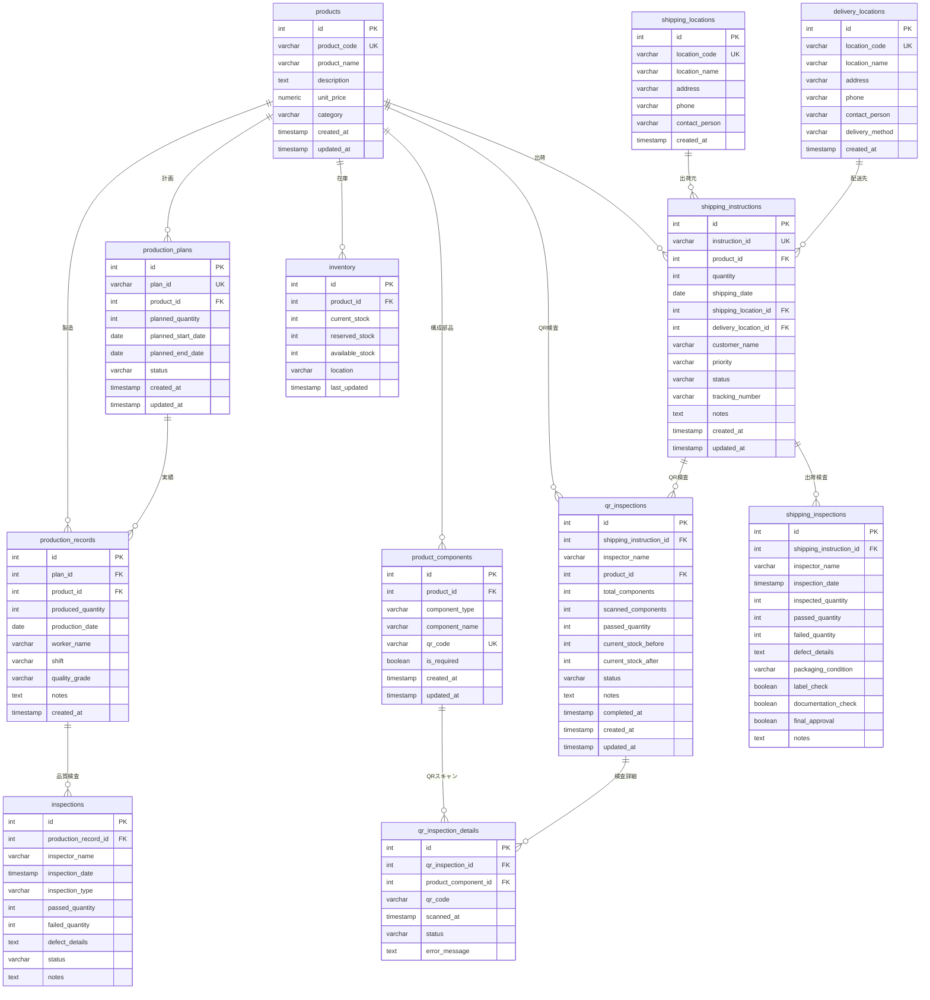
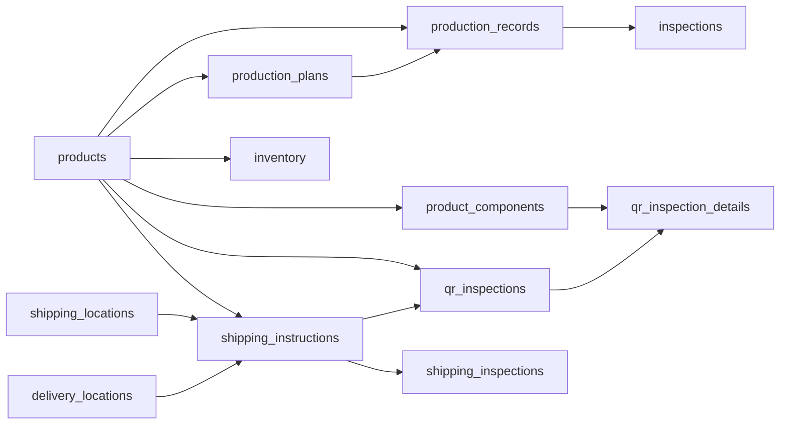

# データベーススキーマ仕様書

## 概要

生産管理システムのPostgreSQLデータベーススキーマ。製品マスタ、生産計画、製造記録、検査、出荷指示、QRコード検査を管理。

- **データベース**: production_db
- **ホスト**: poc-production-db.cj4ycmcqcrbj.ap-northeast-1.rds.amazonaws.com
- **ユーザー**: production_user
- **テーブル数**: 12 (ビュー1含む)

---

## ERダイアグラム



---

## テーブル一覧

| # | テーブル名 | 種別 | 用途 |
|---|-----------|------|------|
| 1 | products | テーブル | 製品マスタ |
| 2 | production_plans | テーブル | 生産計画 |
| 3 | production_records | テーブル | 製造実績 |
| 4 | inspections | テーブル | 品質検査記録 |
| 5 | shipping_instructions | テーブル | 出荷指示 |
| 6 | shipping_inspections | テーブル | 出荷検査記録 |
| 7 | shipping_locations | テーブル | 出荷元拠点 |
| 8 | delivery_locations | テーブル | 配送先拠点 |
| 9 | inventory | テーブル | 在庫管理 |
| 10 | product_components | テーブル | 製品構成部品(QRコード) |
| 11 | qr_inspections | テーブル | QRコード検査記録 |
| 12 | qr_inspection_details | テーブル | QRスキャン詳細 |
| - | shipping_instruction_summary | ビュー | 出荷指示統合ビュー |

---

## 詳細スキーマ定義

### 1. products (製品マスタ)

**用途**: 製品の基本情報を管理

| カラム名 | データ型 | NULL | デフォルト | 制約 | 説明 |
|---------|---------|------|-----------|------|------|
| id | integer | NO | nextval() | PK | 製品ID |
| product_code | varchar(50) | NO | - | UNIQUE | 製品コード |
| product_name | varchar(255) | NO | - | - | 製品名 |
| description | text | YES | - | - | 製品説明 |
| unit_price | numeric | YES | - | - | 単価 |
| category | varchar(100) | YES | - | - | カテゴリー |
| created_at | timestamp | YES | CURRENT_TIMESTAMP | - | 作成日時 |
| updated_at | timestamp | YES | CURRENT_TIMESTAMP | - | 更新日時 |

**リレーション**:
- → production_plans (1:N)
- → production_records (1:N)
- → shipping_instructions (1:N)
- → inventory (1:N)
- → product_components (1:N)
- → qr_inspections (1:N)

---

### 2. production_plans (生産計画)

**用途**: 製品の生産計画を管理

| カラム名 | データ型 | NULL | デフォルト | 制約 | 説明 |
|---------|---------|------|-----------|------|------|
| id | integer | NO | nextval() | PK | 計画ID |
| plan_id | varchar(50) | NO | - | UNIQUE | 計画番号 |
| product_id | integer | YES | - | FK → products | 製品ID |
| planned_quantity | integer | NO | - | - | 計画数量 |
| planned_start_date | date | YES | - | - | 開始予定日 |
| planned_end_date | date | YES | - | - | 完了予定日 |
| status | varchar(20) | YES | 'planned' | - | ステータス |
| created_at | timestamp | YES | CURRENT_TIMESTAMP | - | 作成日時 |
| updated_at | timestamp | YES | CURRENT_TIMESTAMP | - | 更新日時 |

**リレーション**:
- products → (N:1)
- → production_records (1:N)

---

### 3. production_records (製造実績)

**用途**: 実際の製造記録を管理

| カラム名 | データ型 | NULL | デフォルト | 制約 | 説明 |
|---------|---------|------|-----------|------|------|
| id | integer | NO | nextval() | PK | 記録ID |
| plan_id | integer | YES | - | FK → production_plans | 計画ID |
| product_id | integer | YES | - | FK → products | 製品ID |
| produced_quantity | integer | NO | - | - | 製造数量 |
| production_date | date | YES | - | - | 製造日 |
| worker_name | varchar(100) | YES | - | - | 作業者名 |
| shift | varchar(20) | YES | - | - | シフト |
| quality_grade | varchar(10) | YES | 'A' | - | 品質グレード |
| notes | text | YES | - | - | 備考 |
| created_at | timestamp | YES | CURRENT_TIMESTAMP | - | 作成日時 |

**リレーション**:
- production_plans → (N:1)
- products → (N:1)
- → inspections (1:N)

---

### 4. inspections (品質検査記録)

**用途**: 製造後の品質検査結果を記録

| カラム名 | データ型 | NULL | デフォルト | 制約 | 説明 |
|---------|---------|------|-----------|------|------|
| id | integer | NO | nextval() | PK | 検査ID |
| production_record_id | integer | YES | - | FK → production_records | 製造記録ID |
| inspector_name | varchar(100) | NO | - | - | 検査員名 |
| inspection_date | timestamp | YES | CURRENT_TIMESTAMP | - | 検査日時 |
| inspection_type | varchar(50) | YES | - | - | 検査種別 |
| passed_quantity | integer | NO | - | - | 合格数 |
| failed_quantity | integer | YES | 0 | - | 不合格数 |
| defect_details | text | YES | - | - | 不良詳細 |
| status | varchar(20) | YES | 'pending' | - | ステータス |
| notes | text | YES | - | - | 備考 |

**リレーション**:
- production_records → (N:1)

---

### 5. shipping_instructions (出荷指示)

**用途**: 顧客への出荷指示を管理

| カラム名 | データ型 | NULL | デフォルト | 制約 | 説明 |
|---------|---------|------|-----------|------|------|
| id | integer | NO | nextval() | PK | 出荷ID |
| instruction_id | varchar(50) | NO | - | UNIQUE | 出荷指示番号 |
| product_id | integer | YES | - | FK → products | 製品ID |
| quantity | integer | NO | - | - | 出荷数量 |
| shipping_date | date | YES | - | - | 出荷日 |
| shipping_location_id | integer | YES | - | FK → shipping_locations | 出荷元ID |
| delivery_location_id | integer | YES | - | FK → delivery_locations | 配送先ID |
| customer_name | varchar(255) | YES | - | - | 顧客名 |
| priority | varchar(20) | YES | 'normal' | - | 優先度 |
| status | varchar(20) | YES | 'pending' | - | ステータス |
| tracking_number | varchar(100) | YES | - | - | 追跡番号 |
| notes | text | YES | - | - | 備考 |
| created_at | timestamp | YES | CURRENT_TIMESTAMP | - | 作成日時 |
| updated_at | timestamp | YES | CURRENT_TIMESTAMP | - | 更新日時 |

**リレーション**:
- products → (N:1)
- shipping_locations → (N:1)
- delivery_locations → (N:1)
- → shipping_inspections (1:N)
- → qr_inspections (1:N)

---

### 6. shipping_inspections (出荷検査記録)

**用途**: 出荷前の最終検査記録

| カラム名 | データ型 | NULL | デフォルト | 制約 | 説明 |
|---------|---------|------|-----------|------|------|
| id | integer | NO | nextval() | PK | 検査ID |
| shipping_instruction_id | integer | YES | - | FK → shipping_instructions | 出荷指示ID |
| inspector_name | varchar(100) | NO | - | - | 検査員名 |
| inspection_date | timestamp | YES | CURRENT_TIMESTAMP | - | 検査日時 |
| inspected_quantity | integer | NO | - | - | 検査数量 |
| passed_quantity | integer | NO | - | - | 合格数 |
| failed_quantity | integer | YES | 0 | - | 不合格数 |
| defect_details | text | YES | - | - | 不良詳細 |
| packaging_condition | varchar(50) | YES | - | - | 梱包状態 |
| label_check | boolean | YES | false | - | ラベル確認 |
| documentation_check | boolean | YES | false | - | 書類確認 |
| final_approval | boolean | YES | false | - | 最終承認 |
| notes | text | YES | - | - | 備考 |

**リレーション**:
- shipping_instructions → (N:1)

---

### 7. shipping_locations (出荷元拠点)

**用途**: 出荷元となる倉庫や工場の情報

| カラム名 | データ型 | NULL | デフォルト | 制約 | 説明 |
|---------|---------|------|-----------|------|------|
| id | integer | NO | nextval() | PK | 拠点ID |
| location_code | varchar(20) | NO | - | UNIQUE | 拠点コード |
| location_name | varchar(255) | NO | - | - | 拠点名 |
| address | varchar(500) | YES | - | - | 住所 |
| phone | varchar(20) | YES | - | - | 電話番号 |
| contact_person | varchar(100) | YES | - | - | 担当者名 |
| created_at | timestamp | YES | CURRENT_TIMESTAMP | - | 作成日時 |

**リレーション**:
- → shipping_instructions (1:N)

---

### 8. delivery_locations (配送先拠点)

**用途**: 配送先の顧客拠点情報

| カラム名 | データ型 | NULL | デフォルト | 制約 | 説明 |
|---------|---------|------|-----------|------|------|
| id | integer | NO | nextval() | PK | 拠点ID |
| location_code | varchar(20) | NO | - | UNIQUE | 拠点コード |
| location_name | varchar(255) | NO | - | - | 拠点名 |
| address | varchar(500) | YES | - | - | 住所 |
| phone | varchar(20) | YES | - | - | 電話番号 |
| contact_person | varchar(100) | YES | - | - | 担当者名 |
| delivery_method | varchar(50) | YES | '宅配便' | - | 配送方法 |
| created_at | timestamp | YES | CURRENT_TIMESTAMP | - | 作成日時 |

**リレーション**:
- → shipping_instructions (1:N)

---

### 9. inventory (在庫管理)

**用途**: 製品ごとの在庫数量を管理

| カラム名 | データ型 | NULL | デフォルト | 制約 | 説明 |
|---------|---------|------|-----------|------|------|
| id | integer | NO | nextval() | PK | 在庫ID |
| product_id | integer | YES | - | FK → products | 製品ID |
| current_stock | integer | NO | 0 | - | 現在庫数 |
| reserved_stock | integer | NO | 0 | - | 引当済数 |
| available_stock | integer | YES | - | GENERATED | 利用可能数 |
| location | varchar(100) | YES | - | - | 保管場所 |
| last_updated | timestamp | YES | CURRENT_TIMESTAMP | - | 最終更新 |

**リレーション**:
- products → (N:1)

**計算ロジック**:
```sql
available_stock = current_stock - reserved_stock
```

---

### 10. product_components (製品構成部品)

**用途**: 製品を構成する部品とQRコードを管理

| カラム名 | データ型 | NULL | デフォルト | 制約 | 説明 |
|---------|---------|------|-----------|------|------|
| id | integer | NO | nextval() | PK | 部品ID |
| product_id | integer | YES | - | FK → products | 製品ID |
| component_type | varchar(50) | NO | - | - | 部品種別 |
| component_name | varchar(255) | NO | - | - | 部品名 |
| qr_code | varchar(255) | NO | - | UNIQUE | QRコード |
| is_required | boolean | YES | true | - | 必須フラグ |
| created_at | timestamp | YES | CURRENT_TIMESTAMP | - | 作成日時 |
| updated_at | timestamp | YES | CURRENT_TIMESTAMP | - | 更新日時 |

**リレーション**:
- products → (N:1)
- → qr_inspection_details (1:N)

---

### 11. qr_inspections (QRコード検査記録)

**用途**: QRコードスキャンによる検査セッションを管理

| カラム名 | データ型 | NULL | デフォルト | 制約 | 説明 |
|---------|---------|------|-----------|------|------|
| id | integer | NO | nextval() | PK | 検査ID |
| shipping_instruction_id | integer | YES | - | FK → shipping_instructions | 出荷指示ID |
| inspector_name | varchar(100) | NO | - | - | 検査員名 |
| product_id | integer | YES | - | FK → products | 製品ID |
| total_components | integer | NO | - | - | 総部品数 |
| scanned_components | integer | YES | 0 | - | スキャン済数 |
| passed_quantity | integer | YES | 0 | - | 合格数 |
| current_stock_before | integer | YES | - | - | 検査前在庫数 |
| current_stock_after | integer | YES | - | - | 検査後在庫数 |
| status | varchar(50) | YES | 'in_progress' | - | ステータス |
| notes | text | YES | - | - | 備考 |
| completed_at | timestamp | YES | - | - | 完了日時 |
| created_at | timestamp | YES | CURRENT_TIMESTAMP | - | 作成日時 |
| updated_at | timestamp | YES | CURRENT_TIMESTAMP | - | 更新日時 |

**リレーション**:
- shipping_instructions → (N:1)
- products → (N:1)
- → qr_inspection_details (1:N)

**ステータス遷移**:
- `in_progress` → 検査中
- `completed` → 完了
- `failed` → 失敗

---

### 12. qr_inspection_details (QRスキャン詳細)

**用途**: 個別のQRコードスキャン記録

| カラム名 | データ型 | NULL | デフォルト | 制約 | 説明 |
|---------|---------|------|-----------|------|------|
| id | integer | NO | nextval() | PK | 詳細ID |
| qr_inspection_id | integer | YES | - | FK → qr_inspections | 検査ID |
| product_component_id | integer | YES | - | FK → product_components | 部品ID |
| qr_code | varchar(255) | NO | - | - | スキャンQRコード |
| scanned_at | timestamp | YES | CURRENT_TIMESTAMP | - | スキャン日時 |
| status | varchar(50) | YES | 'scanned' | - | ステータス |
| error_message | text | YES | - | - | エラーメッセージ |

**リレーション**:
- qr_inspections → (N:1)
- product_components → (N:1)

**ステータス値**:
- `scanned` → スキャン成功
- `not_found` → QRコード未登録
- `duplicate` → 重複スキャン
- `invalid` → 無効なQRコード

---

### ビュー: shipping_instruction_summary

**用途**: 出荷指示の統合情報を表示

出荷指示に関連する製品、拠点、検査情報を結合したビュー。

**含まれる情報**:
- 出荷指示基本情報 (instruction_id, quantity, shipping_date, status)
- 製品情報 (product_code, product_name)
- 顧客情報 (customer_name)
- 出荷元情報 (shipping_location_name, shipping_address)
- 配送先情報 (delivery_location_name, delivery_address, delivery_location_code)
- 検査情報 (inspector_name, inspection_date, inspected_quantity, passed_quantity, failed_quantity, final_approval)

---

## データ整合性ルール

### 外部キー制約



### ユニーク制約

- `products.product_code` - 製品コード重複防止
- `production_plans.plan_id` - 計画番号重複防止
- `shipping_instructions.instruction_id` - 出荷指示番号重複防止
- `shipping_locations.location_code` - 出荷元コード重複防止
- `delivery_locations.location_code` - 配送先コード重複防止
- `product_components.qr_code` - QRコード重複防止

---

## 初期データ

### 製品マスタ (5件)

| product_code | product_name | unit_price |
|-------------|--------------|------------|
| PROD-001 | 標準製品A | 1000 |
| PROD-002 | 高級製品B | 2500 |
| PROD-003 | 特殊製品C | 1800 |
| PROD-004 | エコノミー製品D | 800 |
| PROD-005 | プレミアム製品E | 3500 |

### 出荷指示 (6件)

| instruction_id | product_code | quantity | status |
|---------------|--------------|----------|--------|
| SHIP-001 | PROD-001 | 100 | pending |
| SHIP-002 | PROD-002 | 50 | pending |
| SHIP-003 | PROD-003 | 75 | pending |
| SHIP-004 | PROD-001 | 200 | pending |
| SHIP-005 | PROD-004 | 150 | pending |
| SHIP-006 | PROD-005 | 30 | completed |

### 在庫 (5件)

全製品に対して現在庫1000、引当済500、利用可能500の初期在庫を設定。

### QRコード登録部品 (10件)

- エンジン部品: QR-ENGINE-001, QR-ENGINE-002
- トランスミッション部品: QR-TRANS-001, QR-TRANS-002
- 電子制御ユニット: QR-ECU-001, QR-ECU-002
- フレーム部品: QR-FRAME-001, QR-FRAME-002
- サスペンション: QR-SUSP-001, QR-SUSP-002

---

## SQL例

### 出荷指示一覧取得

```sql
SELECT * FROM shipping_instruction_summary
WHERE shipping_status = 'pending'
ORDER BY shipping_date;
```

### 在庫利用可能数確認

```sql
SELECT 
    p.product_code,
    p.product_name,
    i.current_stock,
    i.reserved_stock,
    i.available_stock
FROM inventory i
JOIN products p ON i.product_id = p.id
WHERE i.available_stock < 100;
```

### QR検査進捗確認

```sql
SELECT 
    qi.id,
    qi.inspector_name,
    p.product_code,
    qi.total_components,
    qi.scanned_components,
    ROUND(qi.scanned_components::numeric / qi.total_components * 100, 2) as progress_percent,
    qi.status
FROM qr_inspections qi
JOIN products p ON qi.product_id = p.id
WHERE qi.status = 'in_progress';
```

### 製造実績と検査結果

```sql
SELECT 
    pr.production_date,
    p.product_name,
    pr.produced_quantity,
    pr.worker_name,
    i.passed_quantity,
    i.failed_quantity,
    i.inspector_name
FROM production_records pr
JOIN products p ON pr.product_id = p.id
LEFT JOIN inspections i ON i.production_record_id = pr.id
ORDER BY pr.production_date DESC;
```

---

## バージョン情報

- **PostgreSQL**: 15.14
- **スキーマ作成日**: 2025-11-06
- **最終更新**: 2025-11-06
- **初期化スクリプト**:
  - `postgres/init/01-init.sql` - メインスキーマ
  - `postgres/init/02-qr-inspection-tables.sql` - QR検査テーブル

---

## API接続設定

```env
DB_HOST=poc-production-db.cj4ycmcqcrbj.ap-northeast-1.rds.amazonaws.com
DB_PORT=5432
DB_NAME=production_db
DB_USER=production_user
DB_PASSWORD=ChangeThisPassword123!
DB_SSL=true
```

**接続確認**:
```bash
curl https://hispot-iot.com/api/health
# {"status":"OK","timestamp":"2025-11-06T..."}
```

---

## 関連ドキュメント

- [デプロイガイド](./DEPLOYMENT_GUIDE.md)
- [API仕様書](../api/README.md)
- [QR検査システム](./QR_INSPECTION_VERSION_COMPARISON.md)
